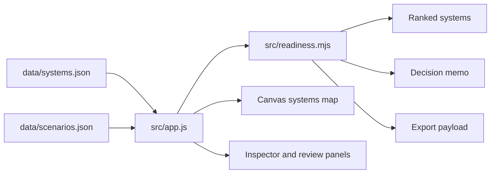

# Architecture

Model Systems Lab is built as a static, modular web app. It avoids framework and bundler dependencies so the project is easy to inspect, fork, and deploy through GitHub Pages.

## Runtime Flow

## Modules

- `src/readiness.mjs`: Normalization, weighted scoring, ranking, tiering, summaries, decision memos, scenario comparison, and export payloads.
- `src/report.mjs`: Markdown report generation for CLI and future automation use.
- `src/app.js`: Browser state, controls, event handling, rendering, canvas drawing, copy/export actions, and inspector rendering.

## Design Choices

- Static assets keep deployment simple.
- Scoring logic is pure JavaScript so it can be tested without a browser.
- Data lives in JSON fixtures to make scenario edits reviewable in pull requests.
- Canvas is used only for the tradeoff visualization; all critical information is also available as text in tables and panels.

## Extension Points

- Add persisted local scenarios with `localStorage`.
- Add CSV export beside the existing JSON export.
- Add model-card markdown generation from the report payload.
- Replace fixture JSON with an API endpoint if the project becomes a live internal tool.
